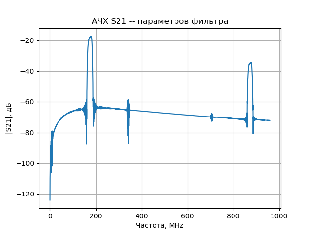

# Модель дельта-функции для фильтров на поверхностных акустических волнах (ПАВ)
## _Delta-function model for SAW filters_

---

_Проект находится в стадии разработки!_

---

Набор классов и функций для моделирования трансверсальных ПАВ-фильтров, оптимизации и подбора параметров. Модель реализована на базе математического аппарата из [1]. На данный момент модель рассчитана только на ВШП с нерасщеплёнными электродами с одинаковой шириной и шагом, но предусматривает возможность аподизации.

_Дальнейшая разработка предполагает значительное расширение функционала и создание python-библиотеки для моделирования подобных фильтров, а также графический интерфейс для ручного моделирования (на базе Qt)._

## Установка зависимостей
Первым делом, скачайте код:
``` 
git clone https://github.com/pas-zhukov/SAW-filters-delta-function-model.git
```
Для работы библиотеки на вашем компьютере должен быть установлен интерпретатор [Python 3.9 или старше](https://www.python.org/downloads/), а также модули, перечисленные в `reqirements.txt`.
Библиотеки можно установить при помощи **pip**:
```
pip install -r requirements.txt
```

## Тестовый запуск
Для тестового запуска необходимо импортировать классы IDT, Apodization и Filter из файла delta_model.py. Затем необходимо создать два экземпляра класса IDT, и на их основе создать фильтр:
```
from delta_model import IDT, Filter

a = IDT(Np=100, apodization=Apodization.sinc, band='wide')
b = IDT(Np=10, band='wide')
c = Filter(a, b, d=100e-3)
c.plot(true_freq=True)
```
Метод `plot` по умолчанию отобразит S21-параметр фильтра в логарифмической шкале.



## Цели проекта

Разработка библиотеки для моделирования трансверсальных и CRF фильтров на поверхностных акустических волнах.

## Источники:

1. Morgan, D.P. Surface Acoustic Wave Filters: With Applications to Electronic Communications and Signal Processing / D.P. Morgan. – London: Academic Press, 2007. – 429 p.